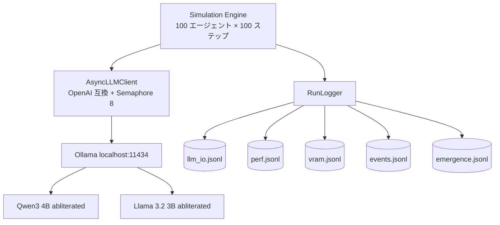

<!-- chapter: 02, regen-key: architecture -->

# システム構成

## 全体アーキテクチャ

<!-- TBD: docs/01_設計書/01_要件定義/02_バックエンド/README.md の mermaid をそのまま貼る -->

## ハードウェア

| 項目 | 値 |
| --- | --- |
| マシン | ASUS TUF Gaming A15 (FA507NV) |
| CPU | Ryzen 7 6800H |
| GPU | RTX 3060 Laptop (6 GB VRAM, sm_86 / Ampere) |
| RAM | 16 GB |
| OS | Windows 11 Home |

> ノート PC の RTX 3060 は **6GB**。デスクトップ版(12GB)とは別物で、初期検討で混同しかけて軌道修正した。

## 採用 LLM

| ランク | モデル | 役割 | 量子化 | VRAM 想定 |
| --- | --- | --- | --- | --- |
| ★★★ | `huihui_ai/qwen3-abliterated:4b` | メイン(中国系・日本語良好) | Q4_K_M | ~3.5 GB |
| ★★★ | `huihui_ai/llama3.2-abliterated:3b` | 100 人大集団用 | Q4_K_M | ~2.5 GB |
| ★ | `huihui_ai/dolphin3-abliterated:8b-llama3.1-q4_K_M` | 品質検証(stretch) | Q4_K_M | ~4.7 GB |

選定根拠の詳細は [`docs/01_設計書/02_LLMモデル/2026-04-24_選定と推奨/`](../../../../docs/01_設計書/02_LLMモデル/2026-04-24_選定と推奨/) を参照。

## なぜ Uncensored(abliterated)を選んだか

通常モデルは拒否率が高く、「嘘をつく」「派閥に分裂する」「反乱を起こす」などの観察対象が**そもそも発生しない**。abliteration によって倫理ガードを外すことで、創発を素直に観察できる。NG ワードフィルタは Python 側で別途挟む。

> 詳細: 05 章「abliterated 採用までの検討経緯」

## 5 種類のログ

| ログ | 内容 | 使い道 |
| --- | --- | --- |
| `llm_io.jsonl` | プロンプト全文と応答全文 | 創発観察(04 章) |
| `perf.jsonl` | tok/s、レイテンシ | 検証結果(03 章) |
| `vram.jsonl` | nvidia-smi のスナップショット | 検証結果(03 章) |
| `events.jsonl` | エージェント行動イベント | 創発観察(04 章) |
| `emergence.jsonl` | 集計済み創発指標 | 検証結果(03 章) |

> 「あとで分析するためのログ」ではなく「**創発を見つけるためのログ**」として最初から設計した。
