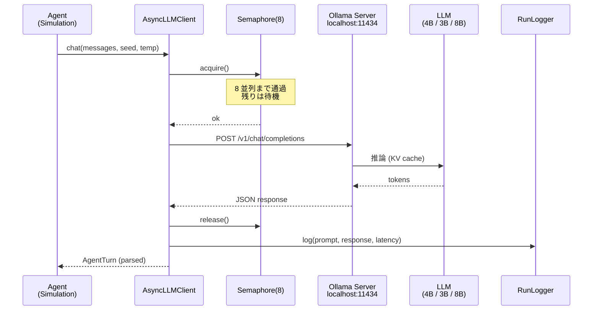

# 03_LLM クライアント

Python から Ollama(OpenAI 互換 API)を叩くクライアントの設計。サーバー差し替え可能性を担保。

## 呼び出しシーケンス

## ドキュメント構成

| # | ファイル | 内容 |
| --- | --- | --- |
| 01 | [01_設計方針.md](01_設計方針.md) | 5 つの設計原則 |
| 02 | [02_エンドポイント.md](02_エンドポイント.md) | Ollama / llama-server / vLLM / Anthropic の互換性 |
| 03 | [03_最小実装_sync.md](03_最小実装_sync.md) | sync 版 LLMClient のリファレンス実装 |
| 04 | [04_async実装.md](04_async実装.md) | 100 並列向けの AsyncLLMClient |
| 05 | [05_エラーハンドリング.md](05_エラーハンドリング.md) | エラー一覧・リトライ・OOM フォールバック |
| 06 | [06_JSON検証.md](06_JSON検証.md) | pydantic スキーマとパーサ |
| 07 | [07_抽象化の勘所.md](07_抽象化の勘所.md) | モデル/サーバー差を隠す設計 |

---

← [02_モデル設定](../02_モデル設定/) | [バックエンド README](../README.md) | → [04_並列実行と性能](../04_並列実行と性能/)
