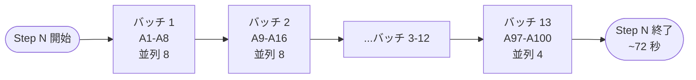

# 04_バッチ直列戦略(100 人 → 13 バッチ × 並列 8)

RTX 3060 6GB では「全員同時」は無理。**バッチを直列に流す** のが堅い。

## 0. 図解: 1 ステップの実行

```
ステップ N (100 エージェントの発話生成)
═══════════════════════════════════════════════════════════════
バッチ 1   ┌─ [A1] [A2] [A3] [A4] [A5] [A6] [A7] [A8] ─┐
           └────── 並列 8 で同時実行 ───────────────────┘   ~5-6 秒
                                  ↓
バッチ 2   ┌─ [A9] [A10] [A11] [A12] [A13] [A14] [A15] [A16] ─┐
           └────── 並列 8 で同時実行 ──────────────────────────┘   ~5-6 秒
                                  ↓
                          ... (バッチ 3〜12)
                                  ↓
バッチ 13  ┌─ [A97] [A98] [A99] [A100] ─┐
           └─── 並列 4 ────────────────┘   ~3 秒
═══════════════════════════════════════════════════════════════
1 ステップ合計: 約 72 秒
100 ステップ合計: 約 120 分
```



## 1. 基本パターン

```python
async def simulate_step(agents, batch_size: int = 8):
    """1 ステップ = 100 エージェントの発話生成"""
    results = {}
    for start in range(0, len(agents), batch_size):
        batch = agents[start:start + batch_size]
        batch_results = await asyncio.gather(
            *[llm.chat(build_messages(a)) for a in batch]
        )
        results.update({a.id: r for a, r in zip(batch, batch_results)})
    return results
```

## 2. ステップ全体の時間

1 バッチ 8 人 × 平均 0.7 秒/エージェント(3B、発話 80 token)= **5-6 秒/バッチ**  
13 バッチ × 5.5 秒 = **約 72 秒/ステップ**  
100 ステップ × 72 秒 = **約 120 分**

→ 「並列 12 + バッチ 9 回」に上げると約 **80 分**。Phase 2 検証で実測して最適化する([08_性能測定プロトコル](08_性能測定プロトコル.md))。

---

← [03_Ollama並列制御](03_Ollama並列制御.md) | [README](README.md) | → [05_VRAM管理](05_VRAM管理.md)
