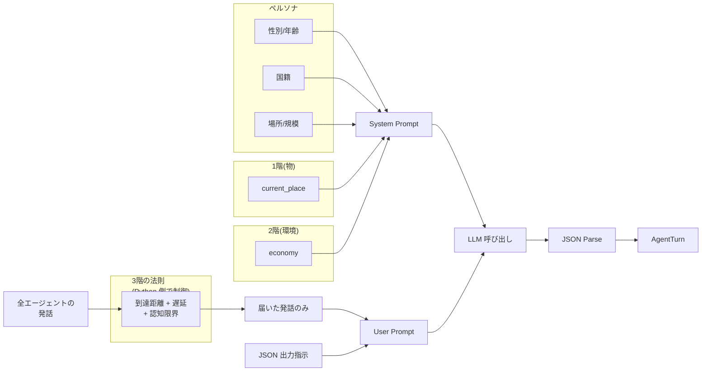

# 01_プロンプトの全体構造

各エージェントの 1 ターンの入力は **3 ブロック** で構成:

```
[System Prompt]
= ペルソナ(4.2 エージェント属性)
+ 1階情報(現在いる place)
+ 2階情報(景気)

[User Prompt]
= 自分が知覚した近傍エージェントの直近発話
+ 出力形式の指示(JSON)
```

## 1 ターンのデータフロー図



---

← [README](README.md) | → [02_System_Prompt](02_System_Prompt.md)
