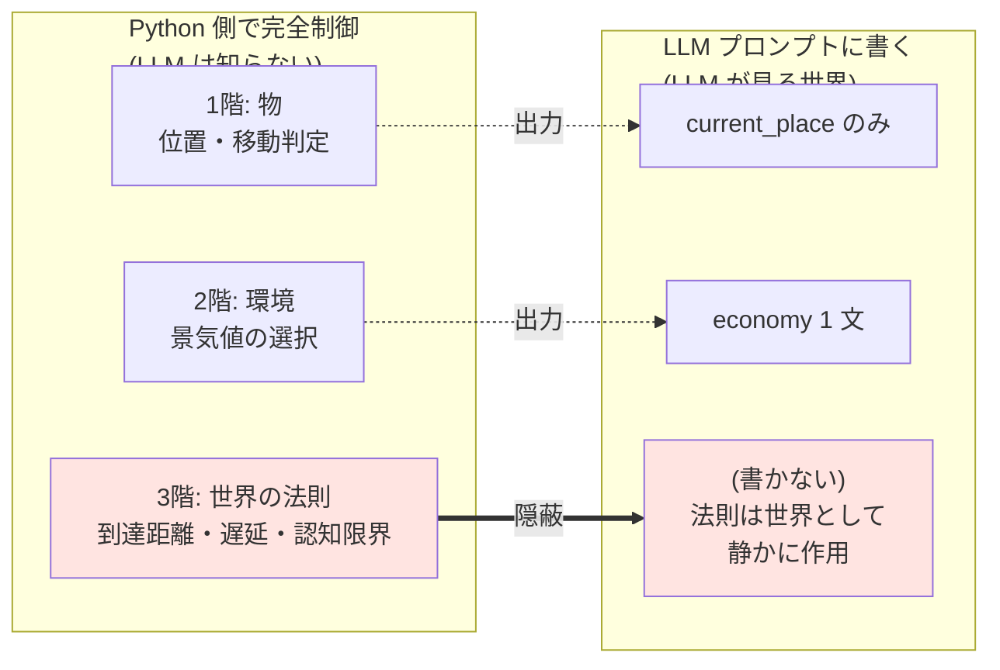

# 05_3 階層モデルの責任分解(重要)

## 図解

赤色のブロックが **本シミュレーションの最重要設計**: 3 階の法則は LLM から完全に隠蔽し、世界として作用させる。

## 責任分解の表

|  | Python 側で制御 | プロンプトに書く |
| --- | --- | --- |
| **1 階(物)**: 場・位置 | 位置・移動判定 | `current_place` のみ明示 |
| **2 階(環境)**: 景気・時間 | 景気値の選択 | `economy` を 1 文で記述 |
| **3 階(法則)**: 到達距離・遅延・認知 | **全部 Python 側**、**プロンプトには書かない** | (プロンプトに登場させない) |

## 1. なぜ 3 階をプロンプトに書かないか

LLM に「あなたの声は半径 5m までしか届きません」と伝えると、エージェントが**法則をメタに認識してしまい創発が死ぬ**。法則は世界として静かに作用させる。

## 2. LLM から見た世界

- LLM には「あなたの周りにはこの発言が届いている」としか見せない
- 届かなかった発言は存在自体を知らない
- これが「到達距離」「遅延」「認知限界」の物理的効果

---

← [04_出力形式](04_出力形式.md) | [README](README.md) | → [06_History管理](06_History管理.md)
