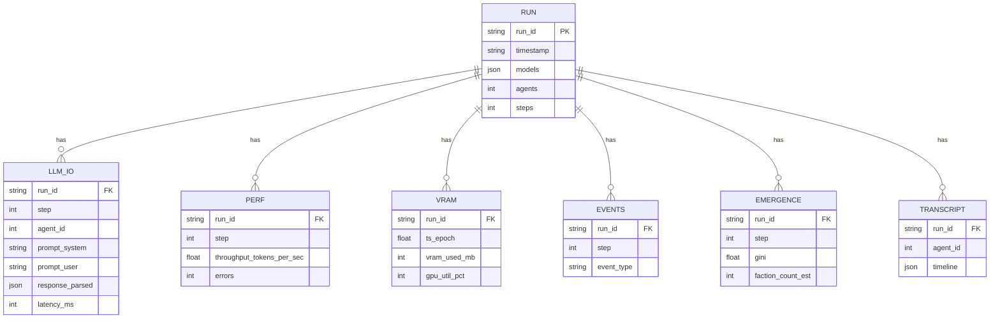

# 02_ディレクトリ構成

```
logs/
  runs/
    {run_id}/
      run.yaml            # 実験 metadata(モデル、seed、params、人数等)
      llm_io.jsonl        # 全 LLM 呼び出しの入出力
      perf.jsonl          # tokens/sec 等のパフォーマンス指標
      vram.jsonl          # VRAM 使用量のサンプリング
      events.jsonl        # シミュレーションのイベント(移動、会議開始等)
      emergence.jsonl     # 創発指標(合意、派閥、リーダー)
      transcripts/
        agent_{id}.jsonl  # エージェント別のタイムライン
```

## ER 図(jsonl 間の関係)



`run_id` をキーにすべての jsonl が結びつく。事後解析では `run.yaml` の metadata と組み合わせて分析する。

---

← [01_ログ設計の原則](01_ログ設計の原則.md) | [README](README.md) | → [03_ログフォーマット](03_ログフォーマット.md)
