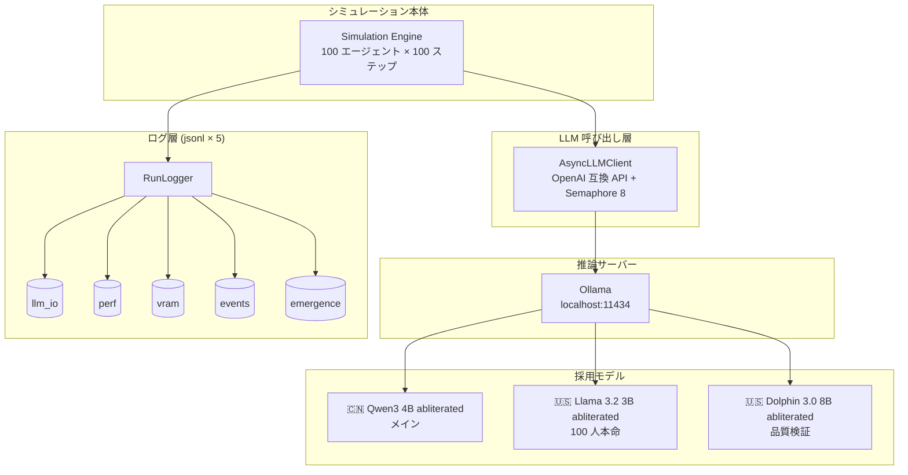

# 02_バックエンド設計

LLM を中心とするバックエンド実装詳細。採用 LLM が確定したことを受け、環境構築から観測まで細分化。

> 📌 LLM モデル選定: [02_LLMモデル/2026-04-24_選定と推奨](../../02_LLMモデル/2026-04-24_選定と推奨.md)  
> 要件定義(機能要件): [../03_機能要件/](../03_機能要件/)  
> 要件定義(非機能要件): [../04_非機能要件/](../04_非機能要件/)  
> システム設計(アーキ全体): [../../06_システム設計/](../../06_システム設計/)

## ドキュメント構成

| # | ファイル | 内容 |
| --- | --- | --- |
| 01 | [01_環境セットアップ/](01_環境セットアップ/) | OS・Ollama・CUDA・モデル pull(節ごとに細分化) |
| 02 | [02_モデル設定/](02_モデル設定/) | Modelfile、推論パラメータ、再現性(モデル別に細分化) |
| 03 | [03_LLMクライアント/](03_LLMクライアント/) | OpenAI 互換 API クライアント、エラーハンドリング(節ごとに細分化) |
| 04 | [04_並列実行と性能/](04_並列実行と性能/) | 並列度、バッチ戦略、VRAM 管理(節ごとに細分化) |
| 05 | [05_プロンプト実装/](05_プロンプト実装/) | ペルソナ、環境、履歴、3 階層モデル実装(節ごとに細分化) |
| 06 | [06_ログと観測/](06_ログと観測/) | LLM I/O ログ、創発指標、性能計測(節ごとに細分化) |

## 位置づけ

- **対象ハードウェア**: ASUS TUF Gaming A15 (RTX 3060 Laptop 6GB / Ryzen 7 6800H / 16GB RAM / Windows 11)
- **採用モデル**:
  - ★★★ `huihui_ai/qwen3-abliterated:4b` (🇨🇳 メイン)
  - ★★★ `huihui_ai/llama3.2-abliterated:3b` (🇺🇸 100 人大集団用)
  - ★ (stretch) `huihui_ai/dolphin3-abliterated:8b-llama3.1-q4_K_M` (🇺🇸 品質検証用)
- **推論サーバー**: Ollama(基本) / llama-server `--cont-batching` (大集団本番、必要時)
- **実装言語**: Python 3.10+ (想定)

## アーキテクチャ概要

各ボックスの詳細は対応するサブフォルダを参照。

## 設計原則

1. **命令は最小限**(議事録 §4): system prompt は状態記述のみ、行動指示を書かない
2. **3 階層モデルの役割分担**: 1 階(物)/2 階(環境)はプロンプトで、3 階(世界の法則)は Python 側で制御
3. **Uncensored の活用**(議事録 §7): 拒否率が低いモデルを素直に活かし、ポストフィルタも最小限
4. **再現性**: `seed` 固定 + `temperature` 明示 + 全 I/O を jsonl ログ
5. **差し替え可能性**: OpenAI 互換 API を挟むことで Ollama ↔ llama-server ↔ API を `base_url` だけで切替
