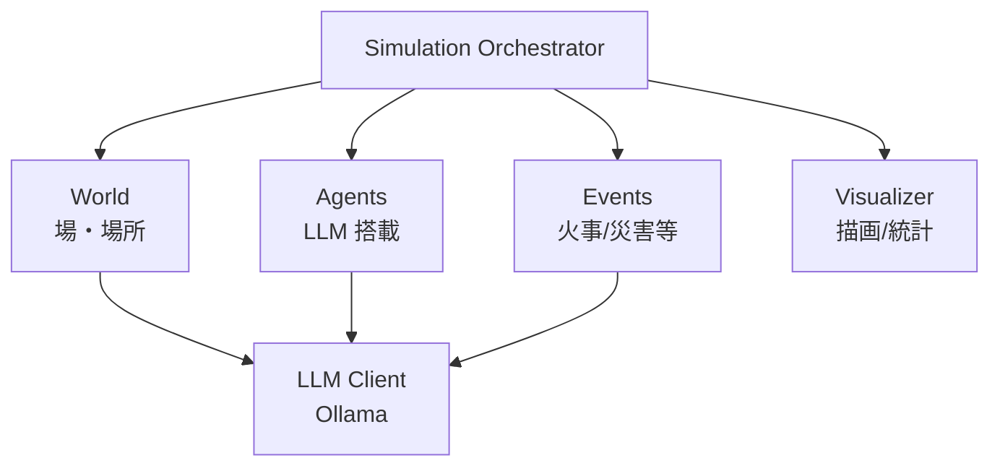

# 01_全体像

参考実装 [2d-multi-places-simulation-on-fire-public](../../../10_共有資料/2d-multi-places-simulation-on-fire-public/) をベースに、以下の 5 要素で構成する。

```
┌─────────────────────────────────────────────────────────────┐
│                     Simulation Orchestrator                  │
│  (ステップ駆動 / イベント活性化 / 統計収集 / ログ書き出し)   │
└─────────┬─────────────┬─────────────┬───────────────┬───────┘
          │             │             │               │
          ▼             ▼             ▼               ▼
    ┌──────────┐  ┌───────────┐ ┌────────────┐ ┌────────────┐
    │  World   │  │  Agents   │ │   Events   │ │  Visualizer│
    │ (場・場所) │  │ (LLM搭載) │ │(火事/災害等)│ │(描画/統計)  │
    └────┬─────┘  └─────┬─────┘ └──────┬─────┘ └────────────┘
         │              │               │
         └──────────────┼───────────────┘
                        ▼
                  ┌───────────┐
                  │ LLM Client │
                  │  (Ollama)  │
                  └───────────┘
```



---

← [README](README.md) | → [02_コンポーネント責務](02_コンポーネント責務.md)
