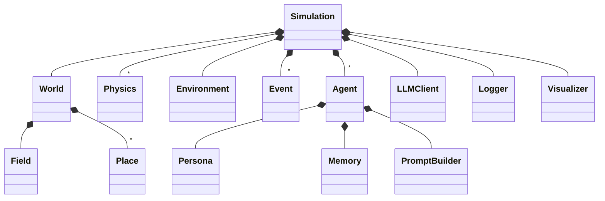

# 03_クラス図(コア)

```
Simulation
 ├── World
 │    ├── Field
 │    └── Place[]
 ├── Physics[]          # 3階: 拡散 / 重力 等
 ├── Environment        # 2階: 量の state
 ├── Event[]            # 火事 / 供給 等
 ├── Agent[]
 │    ├── Persona
 │    ├── Memory
 │    └── PromptBuilder
 ├── LLMClient
 ├── Logger
 └── Visualizer
```



---

← [02_モジュール責務](02_モジュール責務.md) | [README](README.md) | → [04_インタフェース案](04_インタフェース案.md)
