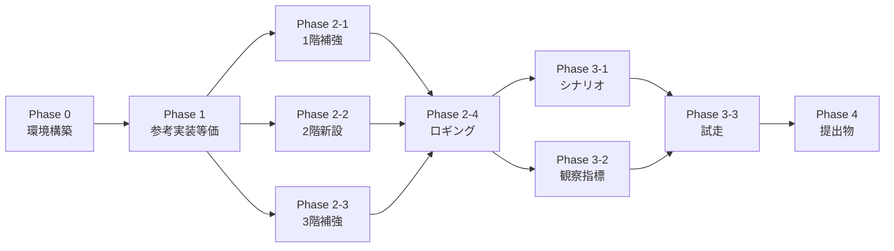

# 02_実装ロードマップ

[01_未準備リスト.md](01_未準備リスト.md) のタスクをフェーズ順に並べたチェックリスト。
各行は ID(B1-01 等)で 01 のリストと結びついている。

> 凡例: `[ ]` 未着手 / `[~]` 進行中 / `[x]` 完了 / `[!]` ブロック中

---

## Phase 0: 環境構築(目標: 1 日以内)

実機で LLM が応答するところまで。

- [x] **C-01** OS / GPU ドライバ / 電源プロファイルの確認 → 検証ログ: [verifications/C-01_前提の確認_2026-04-28.md](verifications/C-01_前提の確認_2026-04-28.md)
- [x] **C-02** Ollama インストール(winget)→ 検証ログ: [verifications/C-02_Ollamaインストール_2026-04-28.md](verifications/C-02_Ollamaインストール_2026-04-28.md)(既存 0.21.2 / API OK)
- [x] **C-03** `OLLAMA_*` 環境変数の永続化 → 検証ログ: [verifications/C-03_環境変数_2026-04-28.md](verifications/C-03_環境変数_2026-04-28.md)(永続化済み・⚠️ Ollama 再起動はユーザ操作待ち)
- [x] **C-04** 採用 3 モデル pull(qwen3-4b → llama3.2-3b → dolphin3-8b、計 ~10GB / 30〜60 分) → 検証ログ: [verifications/C-04_モデルpull_2026-04-28.md](verifications/C-04_モデルpull_2026-04-28.md)(9.6 GB / 約 4 分。⚠️ 設計書の Llama タグ誤りを発見・9 ファイル修正)
- [x] **C-05** Python venv 作成 + 必須パッケージ(`pyyaml`, `numpy`, `matplotlib` 等) → 検証ログ: [verifications/C-05_Python環境_2026-04-28.md](verifications/C-05_Python環境_2026-04-28.md)(`.venv/` 作成 + 29 パッケージ + `requirements.txt`)
- [x] **C-06** 初回ヘルスチェック → 検証ログ: [verifications/C-06_初回ヘルスチェック_2026-04-28.md](verifications/C-06_初回ヘルスチェック_2026-04-28.md) ⚠️ **採用モデルの日本語性能が前提と乖離。設計レビュー必要**

→ 完了条件: `ollama list` で 3 モデル表示 + qwen3-4b に 1 プロンプト投げて応答が返る。

> ⚠️ **2026-04-28 検証結果**: 3 モデルとも応答自体は返るが、**日本語ペルソナ品質が設計の前提と乖離**(Qwen3 4B は英語に転倒、Llama 3.2 3B は gibberish、Dolphin 8B のみ日本語可)。詳細と対応案は [C-06 検証ログ §4](verifications/C-06_初回ヘルスチェック_2026-04-28.md) 参照。Phase 1 着手前にモデル選定の見直しが必要。
>
> 📌 **続報(同日)**: ユーザによる対話モード再検証で **3 モデルすべてが日本語ペルソナを引き受ける** ことを確認(C-06 は false alarm)。
> - Qwen3 4B abliterated: ✅ 自然な日本語、MAIN 採用継続 → [対話確認](../04_モデル検証/2026-04-28_qwen3-4b-abliterated_対話確認.md)
> - Llama 3.2 3B abliterate: △ 不器用な日本語、大集団用に条件付き採用可 → [対話確認](../04_モデル検証/2026-04-28_llama3.2-3b-abliterate_対話確認.md)
> - Dolphin 3.0 8B abliterated: ◯ 文章語・論文調、品質重視シナリオの第 2 候補 → [対話確認](../04_モデル検証/2026-04-28_dolphin3-8b-abliterated_対話確認.md)
>
> 残検証: `/no_think` テスト(Qwen3 速度改善)/ 各モデルの Uncensored 度 / JSON 出力形式での品質確認。

## Phase 1: 参考実装と等価な動作(目標: 1〜2 日)

設計書の構造に切り出しつつ、まず **参考実装と同じシナリオが回る** ところを確認する(デグレチェック)。

### 1-1. プロジェクト雛形

- [ ] **A-01** リポジトリ雛形作成(`src/`, `config/`, `tools/`, `tests/`, `output/`)
- [ ] `pyproject.toml` または `requirements.txt` を新規プロジェクトとして整備

### 1-2. モジュール切り出し

- [ ] **A-02** `src/world/{place,field}.py` を参考実装の `utils.py` から切り出し
- [ ] **A-09** `src/main.py` の CLI 雛形(yaml 読み込み + Simulation 実行)
- [ ] **A-08** `src/simulation.py` を参考実装の `Simulation` から再構成
- [ ] **A-05** `src/agent/agent.py` を参考実装の `Agent` から切り出し
- [ ] **A-06** `src/llm/ollama.py` を参考実装の `OllamaClient` から切り出し
- [ ] **A-04** `src/events/fire.py` を `Event` 抽象下に再配置(まずは派生クラスのみ、抽象は最低限)
- [ ] **A-07** `src/logging/jsonl.py` で既存 JSONL ロガー(`messages.jsonl` / `memory_reasoning.jsonl`)を移植

### 1-3. 動作確認

- [ ] **D-02** `config/scenario_bar_fire.yaml`(参考実装の `config.yaml` 互換)を作成
- [ ] 参考実装と同じパラメータで動作させ、`output/` に同種のログが出ることを確認
- [ ] **B1-06** `random_seed` の config 化(再現性確保のため Phase 1 で投入)

→ 完了条件: 参考実装の `config.yaml` を `scenario_bar_fire.yaml` に置き換えて 5 エージェント × 20 ステップが完走、生成画像が同等。

## Phase 2: MVP+ 差分機能(目標: 2〜3 日)

参考実装にない、設計書で要求した中核機能を入れる。

### 2-1. 1階(物)補強

- [ ] **B1-02** place の入れ子優先順位(`resolve_place` を矩形面積最小優先に)
- [ ] **B1-03** capacity 強制(超過時は新規入室拒否、`pos` を矩形手前で停止)
- [ ] **B1-04** `World.move_agent()` 集中、Agent 直接更新を廃止
- [ ] **B1-05** 初期配置方式(`random_in_place` をデフォルトに)
- [ ] (保留可)**B1-01** 連続座標化 — 整数のままでも回る場合は Phase 3 以降に後送

### 2-2. 2階(環境)新設

- [ ] **A-02**(続き) `src/world/environment.py` 作成
- [ ] **B2-01** `Environment` クラス + `economy: good/bad/neutral` enum
- [ ] **B2-02** system prompt 末尾への景気文挿入を Agent 側に組み込み
- [ ] **B2-03** `economy_text` テンプレ上書き機構

### 2-3. 3階(世界の法則)補強

- [ ] **A-03** `src/physics/{base,communication,cognition}.py` 作成
- [ ] **B3-04** `WorldLaws` 値オブジェクト + バリデーション
- [ ] **B3-03** 認知限界 K の他者ごとエントリ管理(LRU + `memory_re_encountered` 検知)
- [ ] **B3-01** `communication_radius_overrides`(place 単位)
- [ ] (Phase 3 以降に後送可)**B3-02** 情報伝達の遅延キュー

### 2-4. ロギング基盤

- [ ] **B5-01** `events.jsonl` 出力(`place_change` / `place_entry_denied` / `clamp_to_field` / `memory_*`)
- [ ] **B5-02** `run_metadata.json`(scenario / economy / seed / agents / world_laws を 1 ファイルに)

→ 完了条件: 連続座標 or 整数のままで、capacity 強制 + 環境景気 + 認知限界が動作し、`events.jsonl` に上記イベントが記録される。

## Phase 3: シナリオと観察(目標: 2 日)

4 象限の比較実験ができる状態にする。

### 3-1. ペルソナとシナリオ

- [ ] **A-05**(続き)`src/agent/persona.py` を分離
- [ ] **B4-01** `Persona`(役職・社歴・属性)を持つ
- [ ] **B4-04** プロンプトの日本語化(ペルソナ + 状態記述)
- [ ] **D-01** `config/base.yaml` 整備
- [ ] **D-03** `scenario_urban_enterprise.yaml`(都心 × 大企業 × neutral、100 人)
- [ ] **D-04** `scenario_local_startup.yaml`(地方 × スタートアップ × bad、3〜10 人)
- [ ] **D-05** `scenario_urban_startup.yaml`
- [ ] **D-06** `scenario_local_enterprise.yaml`

### 3-2. 観察指標

- [ ] **A-07**(続き)`src/logging/metrics.py` 作成
- [ ] **B5-03** 創発指標集計(発言頻度ジニ / 派閥安定度 / 合意成立判定 / 伝播速度)
- [ ] **B5-04** `tools/analyze_run.py` 雛形
- [ ] **B5-04** `tools/aggregate_runs.py`(複数 run の集計)

### 3-3. 試走

- [ ] 4 象限 × 景気バリエーションのうち、最小 4 ラン(各象限デフォルト)を実行
- [ ] `events.jsonl` から創発指標を計算
- [ ] 結果を見て仮値([05_3階-物理-重力/02_設計の核 §4](../01_設計書/05_3階-物理-重力/02_設計の核.md))を調整

→ 完了条件: 4 象限のベースラインで「観察対象の創発が見える/見えない」が判定できる。

## Phase 4: 提出物(目標: 1 日)

- [ ] **F-04** 検証結果(tok/s, VRAM, 完走時間, 拒否率, 創発指標)を集める
- [ ] 創発観察ログ抜粋を `runs/` から選定
- [ ] [`.claude/skills/submission-pdf/`](../../.claude/skills/submission-pdf/) で章ごとに本文を埋める
- [ ] PDF 生成 → 確認 → 再生成
- [ ] 提出

## オプション(stretch)

着手余裕があれば取り組むもの。

### Stretch-A: 性能・配信

- [ ] **B6-04** async LLM 呼び出し + Semaphore 制御
- [ ] **B6-03** OpenAI 互換 API への移行
- [ ] **C-08** llama-server `--cont-batching` 切替
- [ ] **B5-05** プロンプトキャッシュ最適化

### Stretch-B: イベント拡張

- [ ] **B6-01** `Event` 基底クラスを正式に抽象化(火事以外の追加に備える)
- [ ] **B6-02** Anthropic Claude クライアント実装(`src/llm/anthropic.py`)
- [ ] 災害イベントの第 2 種(地震・停電 等)
- [ ] **B3-02** 情報伝達の遅延キュー(対面 vs 伝聞の差を観察したい場合)

### Stretch-C: 他シナリオ

- [ ] **D-07** 細胞シナリオ / ウイルスシナリオの最小版
- [ ] `src/world/environment.py` の量・拡散を細胞用に拡張
- [ ] `src/physics/diffusion.py`

### Stretch-D: テスト・運用

- [ ] **E-01〜04** ユニットテスト一式
- [ ] **E-05** プリコミット(black / ruff / mypy)
- [ ] **E-06** 「触ってはいけないファイル」リスト
- [ ] **E-07** `runs/<timestamp>/` 規約

---

## クリティカルパスと並走可能タスク

- Phase 2-1 / 2-2 / 2-3 は **並走可能**(別モジュール)
- Phase 3-1 / 3-2 も並走可能
- Phase 0 と Phase 1-1 (雛形作成)は並走可能(モデル pull 待ち時間に雛形を作る)

---

← [01_未準備リスト](01_未準備リスト.md) | [README](README.md)
