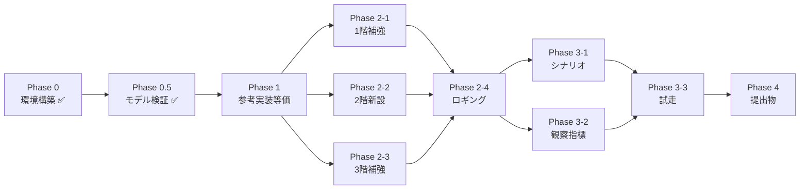

# 02_実装ロードマップ

[01_未準備リスト.md](01_未準備リスト.md) のタスクをフェーズ順に並べたチェックリスト。
各行は ID(B1-01 等)で 01 のリストと結びついている。

> 凡例: `[ ]` 未着手 / `[~]` 進行中 / `[x]` 完了 / `[!]` ブロック中

---

## Phase 0: 環境構築(目標: 1 日以内)

実機で LLM が応答するところまで。

- [x] **C-01** OS / GPU ドライバ / 電源プロファイルの確認 → 検証ログ: [verifications/C-01_前提の確認_2026-04-28.md](verifications/C-01_前提の確認_2026-04-28.md)
- [x] **C-02** Ollama インストール(winget)→ 検証ログ: [verifications/C-02_Ollamaインストール_2026-04-28.md](verifications/C-02_Ollamaインストール_2026-04-28.md)(既存 0.21.2 / API OK)
- [x] **C-03** `OLLAMA_*` 環境変数の永続化 → 検証ログ: [verifications/C-03_環境変数_2026-04-28.md](verifications/C-03_環境変数_2026-04-28.md)(永続化済み・⚠️ Ollama 再起動はユーザ操作待ち)
- [x] **C-04** 採用 3 モデル pull(qwen3-4b → llama3.2-3b → dolphin3-8b、計 ~10GB / 30〜60 分) → 検証ログ: [verifications/C-04_モデルpull_2026-04-28.md](verifications/C-04_モデルpull_2026-04-28.md)(9.6 GB / 約 4 分。⚠️ 設計書の Llama タグ誤りを発見・9 ファイル修正)
- [x] **C-05** Python venv 作成 + 必須パッケージ(`pyyaml`, `numpy`, `matplotlib` 等) → 検証ログ: [verifications/C-05_Python環境_2026-04-28.md](verifications/C-05_Python環境_2026-04-28.md)(`.venv/` 作成 + 29 パッケージ + `requirements.txt`)
- [x] **C-06** 初回ヘルスチェック → 検証ログ: [verifications/C-06_初回ヘルスチェック_2026-04-28.md](verifications/C-06_初回ヘルスチェック_2026-04-28.md) ⚠️ **採用モデルの日本語性能が前提と乖離。設計レビュー必要**

→ 完了条件: `ollama list` で 3 モデル表示 + qwen3-4b に 1 プロンプト投げて応答が返る。

## Phase 0.5: モデル検証(完了)

C-06 で「日本語ペルソナ品質の問題」が発覚したのを受けて、3 モデル各々の品質を実機で検証。結果として **C-06 は false alarm**(試験条件側の問題)と判明、採用方針も整理した。

### 完了タスク

- [x] **M-01** Qwen3 4B abliterated 対話確認 → ✅ 自然な日本語、MAIN 採用継続 → [対話確認](../04_モデル検証/2026-04-28_qwen3-4b-abliterated_対話確認.md)
- [x] **M-02** Llama 3.2 3B abliterate 対話確認 → △ 不器用だが日本語応答 OK → [対話確認](../04_モデル検証/2026-04-28_llama3.2-3b-abliterate_対話確認.md)
- [x] **M-03** Dolphin 3.0 8B abliterated 対話確認 → ◯ 文章語/論文調 → [対話確認](../04_モデル検証/2026-04-28_dolphin3-8b-abliterated_対話確認.md)
- [x] **M-04** 3 モデル JSON 出力品質横並び比較 → ✅ Llama 3.2 3B が JSON+速度両面で最強(平均 2.4s / 120 tok/s) → [JSON 検証](../04_モデル検証/2026-04-28_3モデル_JSON出力品質.md)

### 採用方針(改訂版・確定)

| シナリオ | 第 1 候補 | thinking | 完走見積(8 並列・1 step 2 呼出前提) |
| --- | --- | --- | --- |
| 小集団(2〜10 人)・品質重視 | Qwen3 4B abliterated | OFF デフォルト、調査時のみ ON | 10 体 × 100 ステップ ≒ 50 分(thinking ON でも収まる)|
| 中集団(20〜30 人) | Qwen3 4B abliterated | OFF | 30 体 × 100 ステップ ≒ 約 70 分(thinking ON だと超過、要 `/no_think` 解決)|
| **大集団(100 人)・確定** | **Llama 3.2 3B abliterate** | N/A(thinking なし)| 100 体 × 100 ステップ ≒ 約 100 分 |
| Stretch | **Dolphin 8B(保留)** | — | 1/3 でキー欠落 + 低速の二重問題、`format: schema` 強制が動けば再評価 |

### 残検証(優先度順)

- [ ] **M-05** Qwen3 `/no_think` の正しい指定方法を見つける(system 内 / `think: false` API パラ等)— 🟡 thinking OFF を本番運用するなら必須
- [ ] **M-06** Ollama `format: schema` で Dolphin のキー欠落を救済できるか確認 — 🟢 Dolphin 採用するなら必要
- [ ] **M-07** Uncensored 度の 3 モデル横並び評価(罵倒/反逆プロンプトでの Safety 残存度)— 🟡 abliterated を選んだ理由の検証

> 📌 **方針メモ**: thinking はデフォルト OFF、デバッグ・調査ランのみ ON。詳細は本検証フォルダ各ファイル参照。

## Phase 1: 参考実装と等価な動作(目標: 1〜2 日)

設計書の構造に切り出しつつ、まず **参考実装と同じシナリオが回る** ところを確認する(デグレチェック)。

### 1-1. プロジェクト雛形

- [x] **A-01** リポジトリ雛形作成(`src/`, `config/`, `tools/`, `tests/`, `output/`)
- [x] `pyproject.toml` 整備(requirements.txt は既存)

### 1-2. モジュール切り出し

- [x] **A-02** `src/world/{place,field}.py` を参考実装の `utils.py` から切り出し
- [x] **A-09** `src/main.py` の CLI 雛形(yaml 読み込み + Simulation 実行)
- [x] **A-08** `src/simulation.py` を参考実装の `Simulation` から再構成
- [x] **A-05** `src/agent/agent.py` を参考実装の `Agent` から切り出し
- [x] **A-06** `src/llm/ollama.py` を参考実装の `OllamaClient` から切り出し
- [x] **A-04** `src/events/{base,fire}.py` を `Event` 抽象下に再配置
- [x] **A-07** `src/runlog/jsonl.py` で既存 JSONL ロガーを移植 ※ `src/logging/` は標準ライブラリ衝突回避で `src/runlog/` に改名(設計書同期は Phase 2 で対応)

### 1-3. 動作確認

- [x] **D-02** `config/scenario_bar_fire.yaml`(参考実装の `config.yaml` 互換)を作成
- [x] 5 エージェント × 5 ステップで完走確認 → [Phase1 スモークテスト検証ログ](verifications/Phase1_スモークテスト_2026-04-28.md)
- [x] **B1-06** `random_seed` の config 化(再現性確保)
- [x] **A-budget** 性能バジェット方針確定: **2 呼出のまま継続**(参考実装互換性 + 発話・行動分離による創発観察解像度を優先)→ 設計書 [01_性能バジェット](../01_設計書/06_システム設計/08_バックエンド実装/04_並列実行と性能/01_性能バジェット.md) を 20,000 呼出に更新する必要あり(Phase 2 で対応)

### 1-4. Phase 1 残タスク(優先度 🟢)

- [ ] **A-viz** `src/viz/visualizer.py` を参考実装 `visualization.py` から移植(画像生成・matplotlib プロット)
- [ ] 20 ステップ完走 + 画像生成の同等性確認(Phase 1 完了条件のうち画像部分)

→ 完了条件:5 エージェント × 5 ステップが完走 + jsonl ログ出力 ✅。20 ステップ + 画像生成は Phase 2 と並走で対応。

## Phase 2: MVP+ 差分機能(目標: 2〜3 日)

参考実装にない、設計書で要求した中核機能を入れる。

### 2-1. 1階(物)補強 ✅ 完了

- [x] **B1-02** place の入れ子優先順位(`get_place_at_position` を `half_size` 最小優先に)
- [x] **B1-03** capacity 強制(別 place 入室時に超過なら拒否)
- [x] **B1-04** `World.attempt_move()` 集中、Agent 直接更新を廃止
- [x] **B1-05** 初期配置モード(`random_outside` / `random_in_place`)
- [x] **events.jsonl** 拡張(place_change / place_entry_denied / clamp_to_field)
- [x] **run_metadata.json** 出力(seed / places / llm 要約)
- [ ] (保留可)**B1-01** 連続座標化 — 整数のままで Phase 2 完走、後送

→ 検証ログ: [verifications/Phase2-1_1階補強_2026-04-28.md](verifications/Phase2-1_1階補強_2026-04-28.md)(4 ユニットテスト全合格 + 統合スモーク完走)

### 2-2. 2階(環境)新設 ✅ 完了

- [x] **A-02**(続き) `src/world/environment.py` 作成
- [x] **B2-01** `Environment` クラス + `economy: good/bad/neutral` enum
- [x] **B2-02** system prompt 末尾への景気文挿入を Agent 側に組み込み
- [x] **B2-03** `economy_text` テンプレ上書き機構
- [x] Simulation 統合 + run_metadata.json への景気記録

→ 検証ログ: [verifications/Phase2-2_2階環境_2026-04-28.md](verifications/Phase2-2_2階環境_2026-04-28.md)(6 ユニットテスト合格 + LLM が景気文に呼応することを実機確認)

### 2-3. 3階(世界の法則)補強 ✅ 完了

- [x] **A-03** `src/physics/{base,communication,cognition}.py` 作成
- [x] **B3-04** `WorldLaws` 値オブジェクト + バリデーション
- [x] **B3-03** 認知限界 K の他者ごとエントリ管理(LRU + `memory_re_encountered` 検知)
- [x] **B3-01** `communication_radius_overrides`(place 単位)
- [ ] (Phase 3 以降に後送可)**B3-02** 情報伝達の遅延キュー(値のみ保持済み、配送は未実装)

→ 検証ログ: [verifications/Phase2-3_3階法則_2026-04-28.md](verifications/Phase2-3_3階法則_2026-04-28.md)(5 ユニットテスト合格 + 4 体 × 4 ステップで memory_evicted 40件 / re_encountered 36件)

### 2-4. ロギング基盤 ✅ 完了

- [x] **B5-01** `events.jsonl`(`place_change` / `place_entry_denied` / `clamp_to_field` / `memory_added` / `memory_evicted` / `memory_re_encountered`)
- [x] **B5-02** `run_metadata.json`(scenario / seed / agents / places / environment / world_laws / llm を 1 ファイルに)

→ 完了条件: capacity 強制 + 環境景気 + 認知限界が動作し、`events.jsonl` に 6 種のイベントが記録される ✅

## Phase 3: シナリオと観察(目標: 2 日)

4 象限の比較実験ができる状態にする。

### 3-1. ペルソナとシナリオ ✅ 完了

- [x] **A-05**(続き)`src/agent/persona.py` を分離
- [x] **B4-01** `Persona`(名前・役職・社歴・gender・象限ラベル)+ `PersonaFactory`(分布生成)
- [x] **B4-04** プロンプトの日本語化(`PERSONA` セクションを日本語で挿入、景気文も日本語維持)
- [x] **D-01** `config/base.yaml` 整備 + `extends`(階層継承)機構
- [x] **D-03** `scenario_urban_enterprise.yaml`(都心×大企業×neutral)
- [x] **D-04** `scenario_local_startup.yaml`(地方×スタートアップ×bad)
- [x] **D-05** `scenario_urban_startup.yaml`(都心×スタートアップ×neutral)
- [x] **D-06** `scenario_local_enterprise.yaml`(地方×大企業×neutral)
- [x] run_metadata.json に personas を記録

→ 検証ログ: [verifications/Phase3-1_ペルソナとシナリオ_2026-04-28.md](verifications/Phase3-1_ペルソナとシナリオ_2026-04-28.md)(6 ユニットテスト合格 + bad 景気で LLM 応答にペルソナ + 景気が反映)

> ⚠️ 各シナリオの `num_agents` は本番想定より控えめ(5〜10 体)に設定。Phase 3-3 試走で 100 体へ拡張する。

### 3-2. 観察指標

- [ ] **A-07**(続き)`src/logging/metrics.py` 作成
- [ ] **B5-03** 創発指標集計(発言頻度ジニ / 派閥安定度 / 合意成立判定 / 伝播速度)
- [ ] **B5-04** `tools/analyze_run.py` 雛形
- [ ] **B5-04** `tools/aggregate_runs.py`(複数 run の集計)

### 3-3. 試走

- [ ] 4 象限 × 景気バリエーションのうち、最小 4 ラン(各象限デフォルト)を実行
- [ ] `events.jsonl` から創発指標を計算
- [ ] 結果を見て仮値([05_3階-物理-重力/02_設計の核 §4](../01_設計書/05_3階-物理-重力/02_設計の核.md))を調整

→ 完了条件: 4 象限のベースラインで「観察対象の創発が見える/見えない」が判定できる。

## Phase 4: 提出物(目標: 1 日)

- [ ] **F-04** 検証結果(tok/s, VRAM, 完走時間, 拒否率, 創発指標)を集める
- [ ] 創発観察ログ抜粋を `runs/` から選定
- [ ] [`.claude/skills/submission-pdf/`](../../.claude/skills/submission-pdf/) で章ごとに本文を埋める
- [ ] PDF 生成 → 確認 → 再生成
- [ ] 提出

## オプション(stretch)

着手余裕があれば取り組むもの。

### Stretch-A: 性能・配信

- [ ] **B6-04** async LLM 呼び出し + Semaphore 制御
- [ ] **B6-03** OpenAI 互換 API への移行
- [ ] **C-08** llama-server `--cont-batching` 切替
- [ ] **B5-05** プロンプトキャッシュ最適化

### Stretch-B: イベント拡張

- [ ] **B6-01** `Event` 基底クラスを正式に抽象化(火事以外の追加に備える)
- [ ] **B6-02** Anthropic Claude クライアント実装(`src/llm/anthropic.py`)
- [ ] 災害イベントの第 2 種(地震・停電 等)
- [ ] **B3-02** 情報伝達の遅延キュー(対面 vs 伝聞の差を観察したい場合)

### Stretch-C: 他シナリオ

- [ ] **D-07** 細胞シナリオ / ウイルスシナリオの最小版
- [ ] `src/world/environment.py` の量・拡散を細胞用に拡張
- [ ] `src/physics/diffusion.py`

### Stretch-D: テスト・運用

- [ ] **E-01〜04** ユニットテスト一式
- [ ] **E-05** プリコミット(black / ruff / mypy)
- [ ] **E-06** 「触ってはいけないファイル」リスト
- [ ] **E-07** `runs/<timestamp>/` 規約

---

## クリティカルパスと並走可能タスク

- Phase 0 / 0.5 は **完了済み**
- Phase 2-1 / 2-2 / 2-3 は **並走可能**(別モジュール)
- Phase 3-1 / 3-2 も並走可能
- Phase 0.5 残検証(M-05〜M-07)は Phase 1 と並走可能(別タスク)

---

← [01_未準備リスト](01_未準備リスト.md) | [README](README.md)
